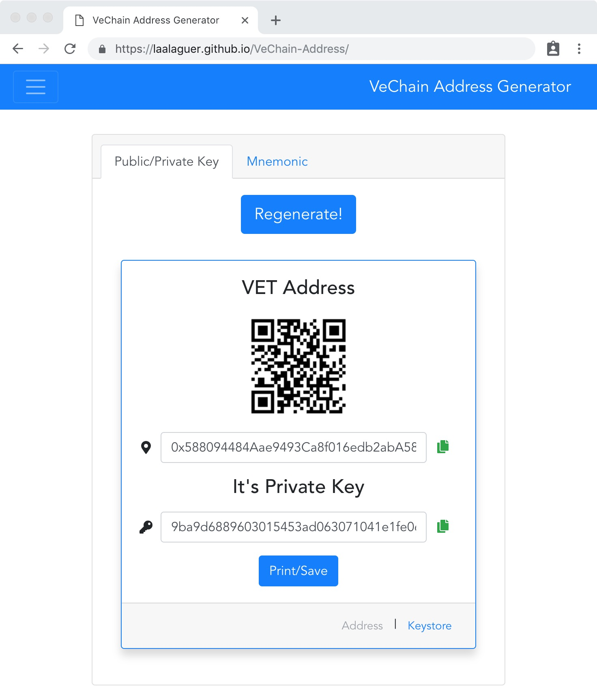

# VeChain Wallet Generator

> A Vue.js project of VeChain wallet generation.

## Web Page Demo
[https://vechainaddress.abyteahead.com](https://vechainaddress.abyteahead.com)



## Download For Offline Usage
This program can be downloaded and run offline. 

After downloading, just click `index.html` in any morden web browser.

Please refer to [release](https://github.com/laalaguer/VeChain-Address/releases) page for zip downloading.

## Security
1. This project runs in user's browser.
2. Random number generator is from user's browser.
3. Open source project.

## Local Development

``` bash
# install dependencies
npm install

# serve with hot reload at localhost:8080
npm run dev

# build for production with minification
npm run build
```

## Prepare for release
```bash
# Build release file
npm run build
npm run publish

# Git add the files
git add .
git commit -m "prepare for v1.1.1 release"

# Tag the git
git tag -a v1.1.1 -m "release message"

# Push the changes to git
git push origin master

# Push the git tag
git push origin v1.1.1
```

## Acknowledgement
Adapted from [vanity-eth](https://github.com/bokub/vanity-eth) project.
